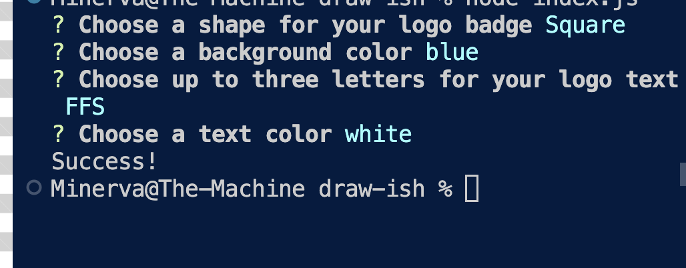

# Draw Something Like A Logo

## Goal
Create a console program that will draw according to user input. User chooses basic shape, three letters for logo text, one color for the shape, and one color for the text. 

[Link to screencastify](https://watch.screencastify.com/v/T1OJewoZePEQxtKee20T)
